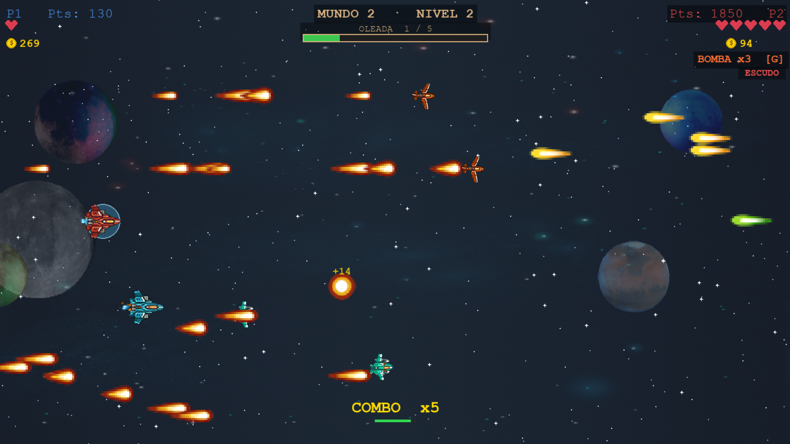

# SpaceDementia

Shoot'em up espacial horizontal desarrollado con Pygame para la materia
de Lógica de Programación II — ITM, Medellín.



## Descripción

SpaceDementia es un juego de naves espaciales con scroll horizontal donde
el jugador debe sobrevivir a 5 mundos, cada uno con 5 niveles y un boss
final. Incluye modo cooperativo de 2 jugadores en el mismo teclado y un
sistema de puntajes estilo arcade.

## Características

- 5 mundos temáticos con dificultad progresiva (25 niveles + 5 bosses)
- Modo 1 jugador y modo cooperativo 2 jugadores (mismo teclado)
- 6 tipos de enemigos: normal, ágil, ráfaga, apuntador y kamikaze
  (persecución directa al jugador)
- Sistema de puntajes arcade (top 10) con tablas separadas para 1 y 2
  jugadores; el nombre se ingresa antes de jugar y se muestra en pantalla
- Tienda entre niveles: escudo, disparo doble, disparo plasma, vida extra,
  mega bomba y revivir compañero (en cooperativo)
- Anomalías espaciales: asteroides, agujeros negros, lluvia de meteoros,
  pulso EMP y zona de interferencia
- Sprites animados del pack SpaceRage (itch.io)
- Música y efectos de sonido
- Sistema de monedas y puntuación por jugador

## Requisitos

- Python 3.10 o superior
- pygame

## Instalación

Desde la carpeta `SpaceDementia/`:

```bash
pip install -r requirements.txt
```

## Ejecución

Desde la carpeta `SpaceDementia/`:

```bash
cd SpaceDementia
python src/main.py
```

## Controles

### Jugador 1 (Nave Azul)
| Acción | Tecla |
|--------|-------|
| Mover | Flechas |
| Disparar | Espacio |
| Mega Bomba | B |

### Jugador 2 (Nave Roja)
| Acción | Tecla |
|--------|-------|
| Mover | WASD |
| Disparar | F |
| Mega Bomba | G |

### General
| Acción | Tecla |
|--------|-------|
| Pausa | P |
| Mutear | M |

## Estructura del proyecto

```
Proyecto-Final-Logica/
├── README.md              # Este archivo
└── SpaceDementia/
    ├── assets/            # Sprites, fondos, audio (ver assets/README.md)
    ├── src/               # Código fuente (ver src/README.md)
    ├── docs/              # Documentación adicional
    ├── tests/             # Pruebas
    ├── diagram.puml       # Diagrama UML de clases (PlantUML)
    ├── game.png           # Captura del gameplay
    ├── requirements.txt   # Dependencias (pygame)
    └── pyproject.toml     # Configuración del proyecto
```

## Créditos

- **Sprites:** SpaceRage Asset Pack por Ravenmore (itch.io)
- **Música:** Sci-Fi Music Pack Vol. 2 (itch.io)
- **Efectos de sonido:** Retro Sci-Fi Sound Fx + Interface Bleeps (itch.io)
- **Desarrollo:** Tomás, Yesica Caro, Juan Manuel Castaño,
  Luis Daniel Zuluaga — ITM Medellín, 2025
