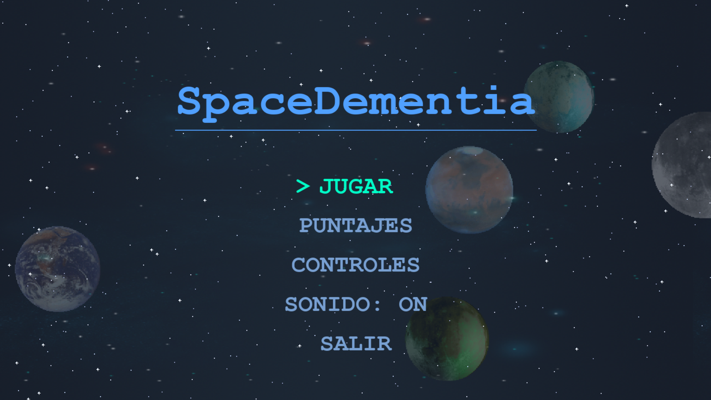
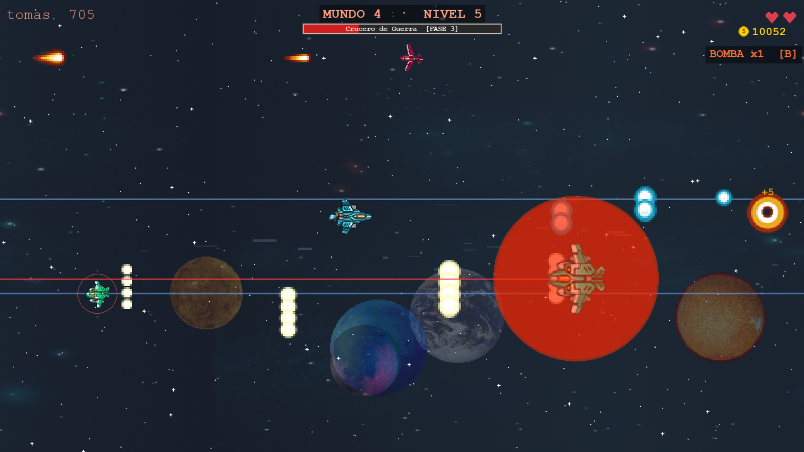
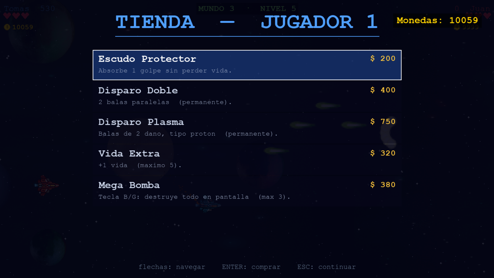
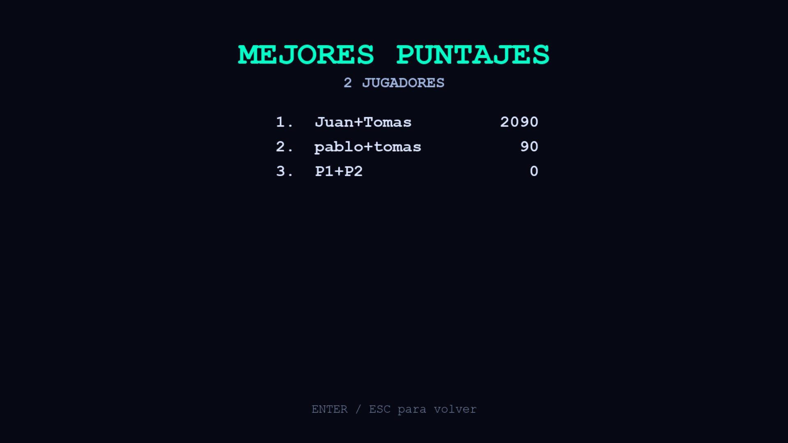
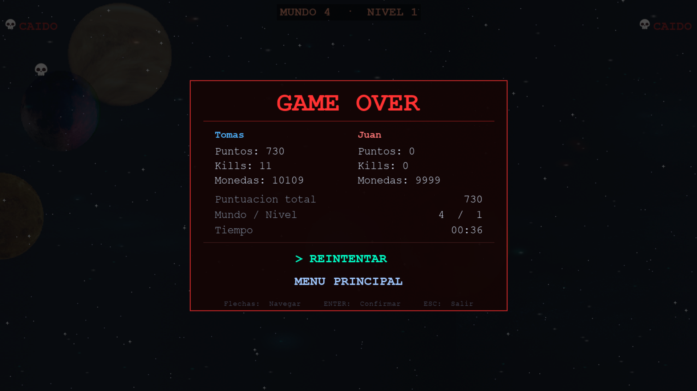
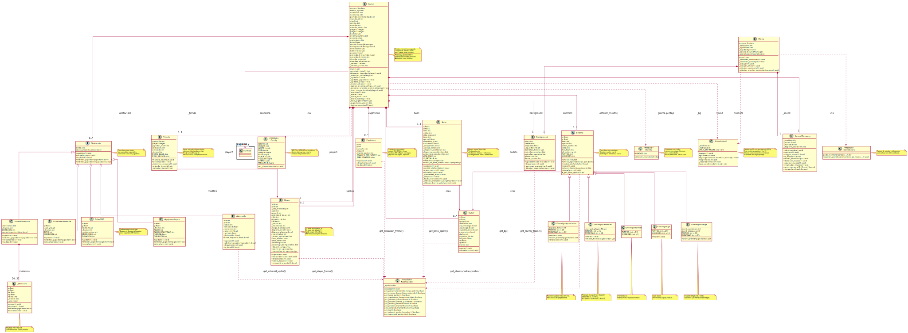

# SpaceDementia

Shoot'em up espacial horizontal desarrollado con **Pygame** para la materia de
Lógica de Programación — ITM, Medellín (2026).


## Descripción

SpaceDementia es un juego de naves con scroll horizontal donde sobrevives a
**5 mundos**, cada uno con 5 niveles y un **boss final único**. Incluye modo
cooperativo de 2 jugadores en el mismo teclado, tienda entre niveles, anomalías
espaciales y un sistema de puntajes estilo arcade con persistencia.

## Características

- **5 mundos temáticos** con dificultad progresiva (cada uno con su paleta,
  enemigos y boss).
- **5 bosses distintos**, cada uno con su propio estilo de ataque
  (tirador, embestidor, rociador, artillero y caótico) y mecánicas especiales:
  rayo láser barredor, escudo temporal indestructible y muro de balas.
- **Modo 1 jugador y cooperativo 2 jugadores** (mismo teclado), con
  estadísticas separadas por jugador al terminar la partida.
- **5 tipos de enemigos**: normal, ágil, ráfaga, apuntador y kamikaze
  (persecución directa al jugador).
- **Variedad visual por código**: los sprites de enemigos se tiñen en memoria
  para dar a cada tipo un color distinto que rota según el mundo, conservando
  los detalles del sprite original (sin archivos extra).
- **Sistema de puntajes arcade** (top 10) con tablas separadas para 1 y 2
  jugadores; el nombre se ingresa antes de jugar y se muestra en pantalla. Los
  puntajes persisten entre sesiones (`scores.json`).
- **Tienda entre niveles**: escudo, disparo doble, disparo plasma, vida extra,
  mega bomba y revivir compañero (en cooperativo).
- **Anomalías espaciales**: zona de asteroides (con rocas de varios tamaños),
  agujeros negros (a veces varios a la vez), lluvia de meteoros que cruza la
  pantalla, pulso EMP y zona de interferencia. También aparecen durante los
  boss fights para mantener la tensión.
- **Sprites animados** del pack SpaceRage (itch.io) y **audio** normalizado
  (música de menú, juego y boss + efectos).

## Capturas

| Menú principal | Boss fight |
|----------------|------------|
|  |  |

| Tienda | Tabla de puntajes |
|--------|-------------------|
|  |  |

| Game Over con estadísticas |
|----------------------------|
|  |

## Requisitos

- Python 3.10 o superior
- pygame

## Instalación y ejecución

Desde la carpeta `SpaceDementia/`:

```bash
cd SpaceDementia
pip install -r requirements.txt
python src/main.py
```

> En Linux/WSL el comando suele ser `python3` en lugar de `python`.

### Ejecutable (Windows)

También se puede jugar sin instalar Python: hay un ejecutable `.exe` para
Windows que se ejecuta con doble clic. El archivo `scores.json` con los
puntajes se crea automáticamente junto al ejecutable y persiste entre partidas.

Para generar el ejecutable desde el código (en Windows, con PyInstaller):

```powershell
pip install pyinstaller
pyinstaller --onefile --windowed --name SpaceDementia --add-data "assets;assets" src/main.py
```

El ejecutable queda en `dist/SpaceDementia.exe`.

## Controles

### Jugador 1 (Nave Azul)
| Acción | Tecla |
|--------|-------|
| Mover | Flechas |
| Disparar | Espacio |
| Mega Bomba | B |

### Jugador 2 (Nave Roja)
| Acción | Tecla |
|--------|-------|
| Mover | WASD |
| Disparar | F |
| Mega Bomba | G |

### General
| Acción | Tecla |
|--------|-------|
| Pausa | P |
| Mutear | M (o desde el menú) |

## Tests

El proyecto incluye pruebas unitarias con `pytest` sobre la lógica pura
(scoreboard y configuración de mundos). Desde la carpeta `SpaceDementia/`:

```bash
python3 -m pytest tests/ -v
```

Ver `SpaceDementia/tests/README.md` para el detalle de qué se prueba.

## Diagrama de clases



La fuente PlantUML está en `SpaceDementia/diagram.puml`.

## Estructura del proyecto

```
Proyecto-Final-Logica/
├── README.md              # Este archivo
└── SpaceDementia/
    ├── assets/            # Sprites, fondos, audio (ver assets/README.md)
    ├── src/               # Código fuente (ver src/README.md)
    ├── docs/              # GIF, capturas y documentación (ver docs/README.md)
    ├── tests/             # Pruebas unitarias (ver tests/README.md)
    ├── diagram.puml       # Diagrama UML de clases (fuente PlantUML)
    ├── UML_FINAL.svg      # Diagrama UML renderizado
    ├── requirements.txt   # Dependencias (pygame)
    └── pyproject.toml     # Configuración del proyecto y de pytest
```

## Arquitectura

`Game` es una máquina de estados (transición → jugando → completado → tienda →
alerta → boss → game over / victoria). El código aplica programación orientada
a objetos con clases base abstractas (`Enemy` y `Obstaculo` son ABC con
subclases polimórficas). Ver `SpaceDementia/src/README.md` para el detalle por
módulo.

## Créditos

- **Concepto original y juego base:** profesor Juan David Navarro (ITM).
  El prototipo inicial usaba figuras geométricas básicas; la versión actual
  fue desarrollada desde esa base con sprites profesionales, arquitectura
  OOP completa, y todas las mecánicas y sistemas descritos arriba.
- **Desarrollo y arquitectura técnica:** Tomás Pérez
- **Sprites:** SpaceRage Asset Pack por Ravenmore (itch.io)
- **Música:** Sci-Fi Music Pack Vol. 2 (itch.io)
- **Efectos de sonido:** Retro Sci-Fi Sound Fx + Interface Bleeps (itch.io)
- **Contexto académico:** Proyecto final de Lógica de Programación — ITM,
  Medellín (2026). Equipo original: Tomás Pérez, Yesica Caro,
  Juan Manuel Castaño y Luis Daniel Zuluaga.
